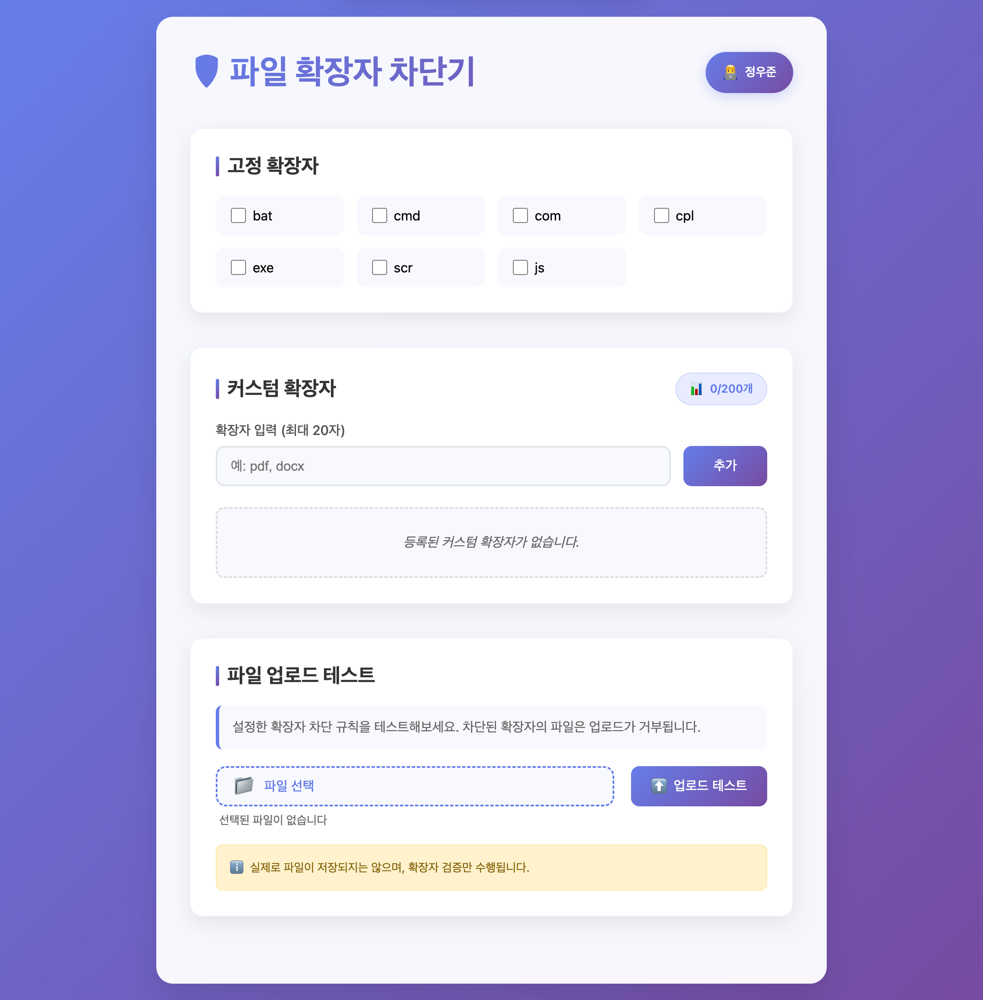
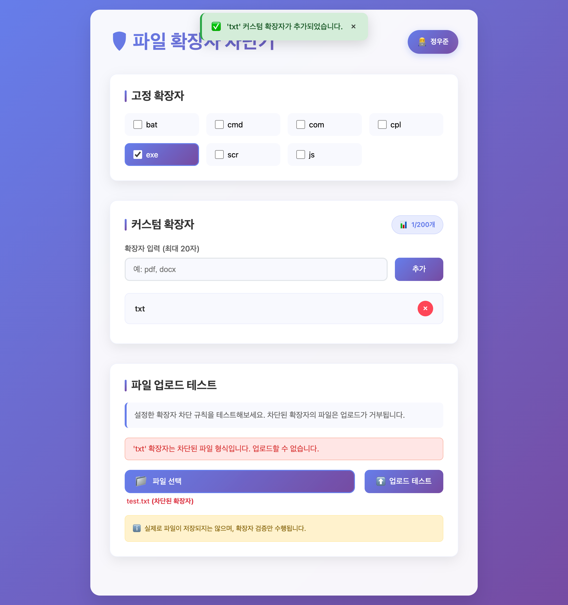

# 🚫 Blocker - File Extension Blocker

파일 확장자 기반 업로드 차단 시스템으로, </br>
고정 확장자와 사용자 정의 확장자를 통해 보안성과 유연성을 동시에 제공합니다.

---

## 📋 주요 기능

### 🔒 확장자 차단 관리
- **고정 확장자**: 서버 시작 시 자동으로 등록되는 보안 위험 확장자들
- **사용자 정의 확장자**: 동적으로 추가/삭제 가능한 커스텀 차단 확장자 (최대 200개)
- **실시간 차단**: 업로드 시점에서 즉시 차단 및 에러 응답

### 🛡️ 보안 및 성능
- **Rate Limiting**: 1분 내 60회 초과 요청 시 10분간 차단 (어뷰징 방지)
- **Soft Delete**: 데이터 무결성 보장을 위한 논리적 삭제
- **멀티스레드 안전**: ConcurrentHashMap 기반 thread-safe 구현

### 🎯 사용자 경험
- **직관적인 웹 UI**: Thymeleaf 기반 관리 인터페이스
- **실시간 상태 확인**: 차단된 확장자 목록 및 개수 실시간 조회
- **업로드 테스트**: 차단 동작 확인을 위한 테스트 폼 제공

---

## 🏗️ 시스템 아키텍처

```
┌─────────────────┐    ┌─────────────────┐    ┌─────────────────┐
│   Rate Limit    │───▶│  Extension      │───▶│   Business      │
│     Filter      │    │ Blocker Filter  │    │     Logic       │
└─────────────────┘    └─────────────────┘    └─────────────────┘
        │                       │                       │
        ▼                       ▼                       ▼
   429 Response           403 Blocked File        API Response
```

### 필터 체인 구성
1. **RateLimitFilter**: 요청 빈도 제한 (최우선 처리)
2. **ExtensionBlockerFilter**: 파일 확장자 검증
3. **Business Logic**: 실제 비즈니스 로직 처리

---

## 🌐 배포 환경

### 인프라 구성
- **서버**: AWS EC2 (Ubuntu 24.04)
- **데이터베이스**: AWS RDS (MySQL 8.0.41)
- **배포**: JAR 파일 직접 배포

### 실제 운영 화면



---

## 🧪 테스트 구성
- **단위 테스트**: 서비스 로직, 필터, 리포지토리 계층
- **통합 테스트**: REST API 엔드포인트(.http 요청/응답)
- **시나리오 테스트**:
    - 중복 생성/복구 시나리오
    - Rate Limiting 경계 조건
    - 파일 업로드 차단 동작

---

## 📁 프로젝트 구조
```plaintext
src/main/java
`-- flow
    `-- extensionblocker
        |-- ExtensionBlockerApplication.java
        |-- application
        |   |-- BlockerService.java
        |   `-- dto
        |       |-- BlockerResponse.java
        |       |-- CreateBlockerRequest.java
        |       |-- CreateBlockerResponse.java
        |       `-- CustomBlockerCountResponse.java
        |-- common
        |   |-- annotation
        |   |   `-- ValidExtension.java
        |   |-- dto
        |   |   `-- ErrorResponse.java
        |   |-- global
        |   |   |-- exception
        |   |   |   |-- ErrorCode.java
        |   |   |   |-- blocker
        |   |   |   |   |-- BlockerAlreadyDeletedException.java
        |   |   |   |   |-- BlockerAlreadyExistsException.java
        |   |   |   |   |-- BlockerLimitExceededException.java
        |   |   |   |   |-- BlockerNotFoundException.java
        |   |   |   |   `-- BlockerValidationException.java
        |   |   |   `-- upload
        |   |   |       `-- UploadRejectedException.java
        |   |   `-- handler
        |   |       `-- GlobalExceptionHandler.java
        |   `-- validation
        |       `-- ExtensionValidator.java
        |-- domain
        |   |-- Blocker.java
        |   |-- BlockerRepository.java
        |   `-- Type.java
        |-- infrastructure
        |   |-- config
        |   |   `-- FixedBlockerInitializer.java
        |   |-- filter
        |   |   |-- RateLimitFilter.java
        |   |   `-- RateLimitStorage.java
        |   `-- persistence
        |       |-- BlockerRepositoryImpl.java
        |       `-- JpaBlockerRepository.java
        `-- presentation
            |-- controller
            |   |-- BlockerController.java
            |   |-- BlockerViewController.java
            |   `-- UploadController.java
            `-- filter
                `-- ExtensionBlockerFilter.java

22 directories, 29 files

```

---

## 💡 개발 철학

### 점진적 개발
1. **PR #1**: 핵심 도메인 모델 및 기본 CRUD
2. **PR #2**: 예외 처리 및 비즈니스 규칙 강화
3. **PR #3**: 사용자 인터페이스 및 사용성 개선
4. **PR #4**: 보안 및 성능 최적화

### 품질 보장
- **높은 테스트 커버리지**: 모든 주요 기능에 대한 검증
- **예외 안전성**: 명확한 에러 메시지와 적절한 HTTP 상태 코드
- **동시성 안전**: thread-safe한 구현으로 프로덕션 환경 대응

### 사용자 중심 설계
- **직관적인 UI**: 확장자 상태를 한눈에 파악 가능
- **개발자 친화적**: localhost 환경에서 Rate Limiting 예외 처리
- **실무적 고려사항**: soft-delete, 중복 처리, 삭제 복구 로직

---
